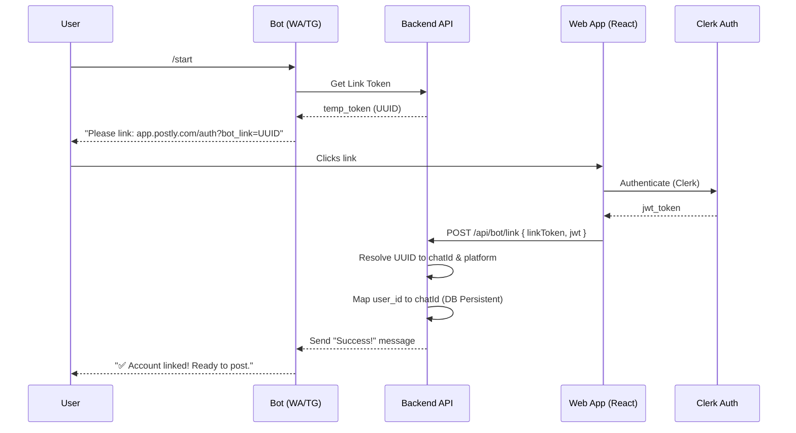

# Postly — SaaS Architecture & Design Document

> **Role**: Staff-Level Full Stack Engineer & Product Architect
> **Objective**: Redesign Postly into a true plug-and-play SaaS for social media automation via WhatsApp/Telegram.

---

## 1. System Overview & Vision

Postly is a "Bot-First" SaaS platform that enables users to manage their social media presence directly from messaging apps. It eliminates the technical barrier for non-developers by owning the API credentials and providing a seamless OAuth-based "one-click" connection experience.

**Core Tenets:**
- **Zero-Config for Users**: No API keys or developer accounts required.
- **Bot-Centric Interaction**: WhatsApp and Telegram are the primary command centers.
- **Web-Based Handshake**: Web dashboard handles the heavy lifting of Auth and OAuth.
- **Multi-Tenant Isolation**: Rigorous data separation and per-user token management.

---

## 2. Directory Structure (Plug-and-Play SaaS)

```
postly/
├── prisma/                    # Deliverable 2: Database Schema
│   └── schema.prisma          # Multi-tenant optimized models
├── src/                       # Deliverable 8: Backend Service Structure
│   ├── app.js                 # Express orchestration
│   ├── server.js              # Production startup & shutdown
│   ├── bot/                   # Deliverable 5 & 6: Bot Integrations
│   │   ├── telegram/          # Telegram adapter (Grammy)
│   │   └── whatsapp/          # WhatsApp adapter (Twilio)
│   ├── services/              # Business logic (Publish, AI, Auth)
│   ├── controllers/           # HTTP Handlers (API, Webhooks)
│   ├── middlewares/           # Deliverable 9: Security (JWT, RBAC, CSRF)
│   ├── queue/                 # Redis-backed job processing (BullMQ)
│   └── utils/                 # Helpers (Encryption, JWT, Prompts)
├── frontend/                  # Deliverable 7: React Page Structure
│   ├── src/
│   │   ├── pages/             # Route-level components
│   │   ├── components/        # Reusable UI (Tailwind)
│   │   └── lib/               # API clients & state management
└── docker/                    # Deliverable 10: Deployment
    └── Dockerfile             # Multi-stage production build
```

---

## 3. Database Architecture (Deliverable 2)

We use **PostgreSQL** with **Prisma** for strong typing and multi-tenancy.

- **`User`**: Centralized identity with Role-Based Access Control (`ADMIN`, `USER`).
- **`SocialAccount`**: Per-user, per-platform OAuth tokens. **Access/Refresh tokens are AES-256-GCM encrypted.**
- **`WhatsappConnection` / `TelegramConnection`**: Persistent mapping of user IDs to bot chat IDs, enabling one-time authentication.
- **`Post` / `PlatformPost`**: Tracks the lifecycle of content from idea to published URL.

---

## 4. OAuth & Security Architecture (Deliverable 4 & 9)

### 4.1 "Only SaaS Owns the App" Rule
The platform owns the Developer Apps (Twitter, LinkedIn, Meta). Users simply grant permissions to the Postly App.

### 4.2 Security Layers
- **JWT + Refresh Token Rotation**: Secure session management.
- **Encrypted Token Storage**: Sensitive OAuth tokens are encrypted at rest using a 32-byte master key.
- **OAuth State Validation**: CSRF protection for all social connections.
- **RBAC**: Middleware enforces that users cannot access admin stats, and admins cannot post as users.

---

## 5. Sequence Diagram: Seamless Bot Linking (Deliverable 10)



---

## 6. Development Roadmap (Deliverable 12)

### Phase 1: Foundation & Persistence
- [x] Update Prisma schema with persistent connection tables.
- [x] Implement Clerk sync and local User role mapping.
- [x] Refactor Bot Session to use the database for persistence.

### Phase 2: The "Connect" Experience
- [ ] Build `/platforms` page with OAuth "Connect" buttons.
- [ ] Implement Facebook & Instagram OAuth flows (Meta Graph API).
- [ ] Add encryption/decryption utilities for SaaS-wide secrets.

### Phase 3: Bot Brain & AI
- [ ] Finalize the "Plug-and-Play" start command logic.
- [ ] Refine AI prompts for multi-platform formatting.
- [ ] Implement "Trending Topics" analytics on the backend.

### Phase 4: Admin & Scaling
- [ ] Build the Admin Dashboard with user/post statistics.
- [ ] Set up BullMQ worker for background publishing.
- [ ] Dockerize the entire stack for SaaS deployment.

---

## 7. Critical Code Flow: OAuth Connection (Deliverable 13)

```javascript
// src/services/oauth.service.js
async function handleTwitterCallback(code, state) {
  // 1. Verify CSRF state from Redis
  // 2. Exchange code for tokens using SaaS-owned CLIENT_ID/SECRET
  // 3. Encrypt access_token and refresh_token
  // 4. Upsert into SocialAccount table with current userId
}
```

---

## 8. Multi-Tenancy Design

Every service method and API route is strictly scoped:
- **`req.userId`** is populated by `requireAuth` middleware.
- All Prisma queries include `{ where: { userId: req.userId } }`.
- Platform publishing jobs in the queue carry the `userId` to ensure the correct `SocialAccount` tokens are retrieved and decrypted.
